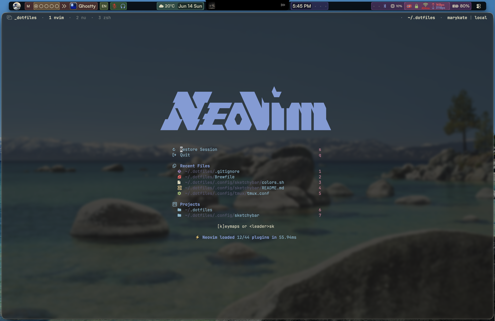
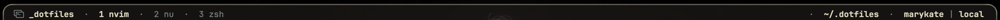
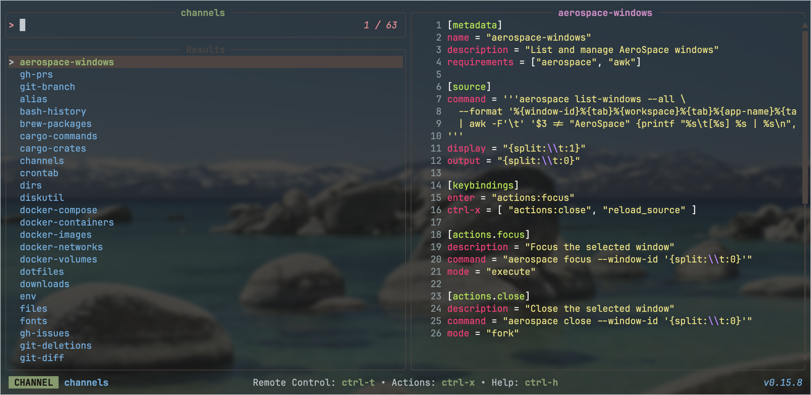

# .dotfiles

> [!WARNING]
> install.sh currently only for manual install.




## .config/sketchybar/README.md

# sketchybar

>git submodule from [.dotfiles](https://github.com/marykatemas/.dotfiles)


<kbd>⌃⌥⌘⇧ Z</kbd> — zen mode (via skhd).
Besides zen mode, skhd runs other scripts too — check `~/.config/skhd/skhdrc`.

Config: `~/.config/sketchybar/`

External palette: `~/.dotfiles/styles/palette.sh` (sourced in `colors.sh`).

```
├── sketchybarrc       # entry point
├── sourcefile.sh      # shared source for everything
├── colors.sh / icons.sh / paths.sh
├── assets/
├── items/*.sh         # item definitions
├── plugins/*/         # plugin.sh, click.sh, watcher.sh
└── helpers/
    ├── rainbow.py                # rainbow bracket PNGs
    └── event_providers/          # C helpers (FelixKratz)
        ├── cpu_load/
        └── network_load/
```

### Reload & Rebuild helpers

```sh
sketchybar --reload
```

## .config/tmux/README.md

# tmux



Config: `~/.config/tmux/tmux.conf`

TPM auto-installs on tmux start if missing.

Inside tmux:

- Install plugins: `prefix + Shift+i` (capital I)
- Update plugins: `prefix + Shift+u` (capital U)
- Reload config: `prefix + r`

Prefix is `Ctrl + a`

## .config/television/README.md

# television



Config: `~/.config/television/config.toml`

- Default channels: `~/.config/television/cable/`
- Custom channels: `~/.config/television/custom-channels/`

To use custom channel - `tv --cable-dir ~/.config/television/custom-channels channel`

Update default channels:

```sh
rm -rf ~/.config/television/cable && tv update-channels
```
